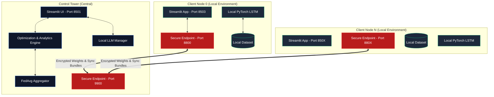
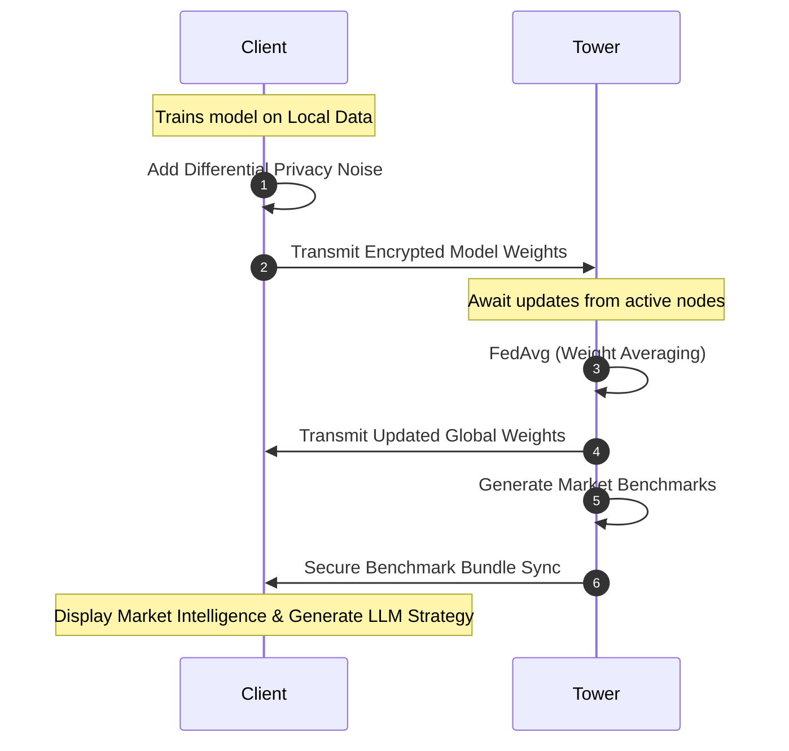

<div align="center">
  <h1>🛡️ Federated Supply Chain Control Tower</h1>
  <p><b>A Secure, Privacy-Preserving Federated Learning Demo for Supply Chain Optimization</b></p>
  
  [](https://www.python.org)
  [](https://pytorch.org)
  [](https://streamlit.io)
  [](#)
  [](#)
</div>

---

## 📖 Overview

The **Federated Supply Chain Control Tower** is a state-of-the-art simulation project demonstrating how multiple client nodes (e.g., dairy distributors) can collaboratively train an AI forecasting model **without ever sharing their raw, sensitive business data**. 

Designed for the modern, privacy-first era, this system leverages **Federated Learning (FedAvg)**, **Differential Privacy**, and **Secure Cryptographic Communication** to optimize supply chain demand, reduce emissions, and boost net profit. It also integrates a **Local GGUF Large Language Model (LLM)** to provide strategic AI insights directly to client nodes based on privacy-safe market benchmarks.

---

## 🌟 Key Features

### 🏢 Control Tower (Central Aggregator)
- **Federated Orchestration:** Coordinates machine learning rounds across all active client nodes.
- **Privacy-Preserving Aggregation:** Uses FedAvg to combine local model weights with added differential privacy noise.
- **Advanced Optimization:** Calculates optimal order quantities, emissions feasibility, and financial metrics (revenue, cost, waste).
- **Secure File Handling:** Receives encrypted `.csv`, `.xls`, or `.xlsx` raw data uploads from clients.
- **Market Benchmarking:** Generates sanitized, peer-comparison bundles and securely syncs them to online nodes.
- **Human-in-the-Loop Override:** View, edit, and approve order recommendations before final execution.

### 🏪 Client Node (Edge Participant)
- **Local Model Training:** Trains a PyTorch LSTM demand-forecasting model purely on local data.
- **Secure Endpoints:** Exposes a secure `/health` and `/sync` API authenticated via HMAC-SHA256 and Fernet encryption.
- **Private Market View:** Compares local performance against global market trends without exposing individual peer data.
- **AI-Powered Insights:** Uses a local LLM to generate strategic business advice based on current metrics.

---

## 🏗️ System Architecture



---

## 🔐 Security & Privacy Workflow

The primary value proposition of this control tower is **Trust**. 

1. **Local Training:** Raw client datasets never leave their native environment during the learning phase.
2. **Differential Privacy:** Before weights are sent to the Control Tower, statistical noise is added to prevent reverse engineering of exact data points.
3. **Secure Communication:** All communication between nodes relies on a pre-shared secret (`SC_SHARED_SECRET`), wrapped in HMAC signatures and AES encryption to prevent tampering and replay attacks.
4. **Market Aggregation Validation:** Benchmarks are only distributed if a minimum threshold cohort of nodes are active, ensuring absolute anonymity.



---

## 📈 Supply Chain Optimization Engine

Post-forecast, the engine runs an optimization sequence to determine the most profitable and eco-friendly order quantities.

| Metric | Calculation Logic |
| :--- | :--- |
| **Safety Stock** | `Forecast × (0.1 + Disruption Risk)` |
| **Target Order Quantity** | `Max(0, Forecast + Safety Stock - Current Inventory)` |
| **Total Emissions** | `Order Quantity × Emission Factor` |
| **Net Profit** | `(Revenue) - (Order Cost) - (Waste Cost)` |

---

## 🚀 Getting Started

### 1. Prerequisites
- **Python:** `3.10+` recommended
- **Local AI:** A compatible GGUF Model (e.g., `SupplyChain-Qwen.gguf`) placed in `/models`
- **Llama.cpp:** Pre-compiled binaries present in `/Llama-cpp-cpu`

### 2. Installation
Clone the repository and install dependencies:
```bash
git clone https://github.com/Prithwiraj731/Federated-Learning-Supply-Chain-Final.git
cd Federated-Learning-Supply-Chain-Final
pip install -r requirements.txt
```

### 3. Running the Simulation
Because this is a multi-node simulation, you will run multiple Streamlit instances on different ports.

#### Start the Control Tower
```bash
# Starts UI on port 8501, Secure Endpoint on port 9900
python -m streamlit run app.py
```

#### Start Client Node 0
```bash
# PowerShell
$env:SC_CLIENT_ID="0"
$env:SC_NODE_PORT="8800"
python -m streamlit run client_app.py --server.port 8503

# Windows CMD
# set SC_CLIENT_ID=0
# set SC_NODE_PORT=8800
# python -m streamlit run client_app.py --server.port 8503
```

#### Start Client Node 1
```bash
# PowerShell
$env:SC_CLIENT_ID="1"
$env:SC_NODE_PORT="8801"
python -m streamlit run client_app.py --server.port 8504
```

---

## 💻 Demo Workflow

To experience the full capability of the Control Tower:

1. **Upload Data:** In a Client App (e.g., `localhost:8503`), navigate to **Upload Data** and submit a `.csv` or `.xlsx` file.
2. **Ping Nodes:** In the Control Tower (`localhost:8501`), go to **Node Network** and click **Refresh Node Status** to ensure nodes are alive.
3. **Train Model:** Navigate to the **Control Center** tab and run the federated simulation.
4. **Sync Intelligence:** Return to **Node Network** and click **Secure Sync Online Nodes**.
5. **View Insights:** In the Client App, open **Market View** to see privacy-safe benchmarking, and generate custom **AI Insights**.

---

## 📁 Required Dataset Structure

Raw uploads from clients must contain the following minimum columns:

```csv
demand, disruption_prob, emission_factor
100, 0.20, 1.50
120, 0.18, 1.55
```
*Optional but recommended columns: `week`, `date`, `brand`, `inventory_level`, `profit_margin`.*

---

## ⚙️ Configuration & Environment Variables

| Variable | Description | Default Example |
| :--- | :--- | :--- |
| `SC_SHARED_SECRET` | Cryptographic key for node-tower communication | `my-demo-shared-secret` |
| `SC_CLIENT_ID` | Unique ID for the node | `0`, `1`, `2` |
| `SC_NODE_PORT` | Port for the node's secure listener API | `8800` |
| `SC_TOWER_HOST` | Hostname of the Control Tower | `127.0.0.1` |
| `SC_TOWER_PORT` | Port for the Tower's secure listener API | `9900` |
| `SC_LLM_GGUF_PATH` | Direct path to the local AI model | `models/SupplyChain-Qwen.gguf` |

---

<div align="center">
  <p>Built as a final project demonstrating the intersection of <b>Supply Chain Logistics</b>, <b>Artificial Intelligence</b>, and <b>Data Privacy</b>.</p>
</div>
